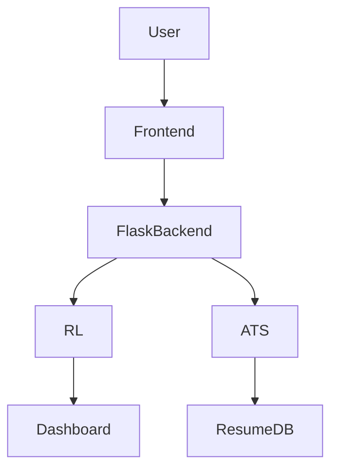

# 🚀 AI-Powered Interview Coach

An adaptive AI interview platform combining Reinforcement Learning, Speech Analysis, Computer Vision, and ATS Resume Evaluation.

Unlike traditional interview assistants, the platform learns which coaching strategy helps users improve faster through an OpenEnv-compatible RL environment.
---

## 1. Hero Image / GIF


*(User logs in ↓ Starts Interview ↓ AI Feedback ↓ RL Chooses Strategy ↓ Dashboard Updates)*

## 2. What is this?

AI-Powered Interview Coach is a full-stack application that provides interactive interview practice and an OpenEnv-compliant reinforcement learning environment (`InterviewCoachEnv`). It learns which coaching strategies (strict/moderate/hint) maximize long-term improvement for a candidate, providing personalization that adapts over episodes.

## 3. Live Demo + Video

- 🎥 **Video Demonstration:** [Watch on YouTube](https://youtu.be/xXdJKlznc2g?si=mI-OhNjt-l5tVC6q)
- 🌐 **Live App:** [Hugging Face Space](https://huggingface.co/spaces/Shauriya24/AI-Powered-Interview-Coach)

## 4. Key Features

✅ **Text Interview**  
✅ **Audio Interview**  
✅ **Video Interview**  
✅ **ATS Resume Scanner**  
✅ **Reinforcement Learning Coach**  
✅ **Speech Analysis**  
✅ **Posture Detection**  
✅ **PDF Report Generation**  

## 5. Architecture



## 7. Tech Stack

 
 
 
 
 


## 8. Why RL?

Existing interview bots always generate feedback the same way.

Our platform treats interview coaching as a sequential decision-making problem where an RL agent learns whether strict criticism, balanced feedback, or hints maximize long-term improvement.

## 9. Training Results

**1000** RL Episodes  
**23** Average Reward  
**3** Learned Feedback Policies  
**10–15%** Stable Win Rate  
**9** Interview Tasks  
**2.4M** Training Samples  


### Dataset Source
- Dataset collects from Kaggle and other sites


## 10. Project Structure

```text
AI-Powered-Interview-Coach/
|- app.py                           # Flask web app
|- baseline.py                      # OpenAI baseline evaluation
|- inference.py                     # Model inference benchmark
|- openenv.yaml                     # OpenEnv specification
|- requirements.txt                 # Core dependencies
|- rl_interview_coach/              # RL Environment & Agent
|- scripts/                         # Utilities and CLI
|- static/                          # Frontend assets
|- templates/                       # HTML templates
|- reports/                         # User reports and run logs
|- models/                          # Saved agent checkpoints
```

## 11. Installation

**Prerequisites:** Python 3.10+, FFmpeg (for audio/video features)

### 1) Environment Setup

```bash
# Unix/macOS
python3 -m venv .venv
source .venv/bin/activate
python -m pip install -r requirements.txt

# Windows (PowerShell)
python -m venv .venv
.\.venv\Scripts\Activate.ps1
python -m pip install -r requirements.txt
```

### 2) Core Configuration

Create a `.env` file in the project root:

```env
API_KEY=your_openai_or_aiml_api_key
FLASK_SECRET_KEY=your_secret_key_here
```

### 3) Run the App

```bash
python app.py
```

Open `http://127.0.0.1:7860` in your browser.

## 12. Future Improvements

- More dataset
- Train
- UI change

---
Made with ❤️ by team CodeSync
- [Sarthak Maheshwari](https://github.com/Sarthak1Developer)
- [Shauriya Garg](https://github.com/ShauriyaDeveloper1)
